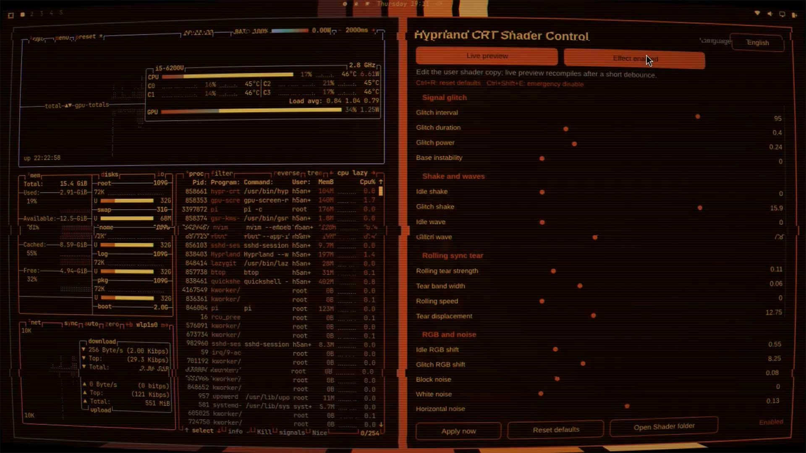

# Hyprland CRT Shader

一个用于 Hyprland 的单 Pass CRT / 模拟电视屏幕 Shader，并提供 Rust + Slint 原生图形控制面板进行实时调节。

[English](../README.md) · [开发与贡献](../CONTRIBUTING.md) · [兼容性](COMPATIBILITY.md) · [性能说明](PERFORMANCE.md) · [更新日志](../CHANGELOG.md)

## 演示

[](https://youtu.be/snSKB8iGME8)

▶️ **点击上方图片观看 YouTube 演示视频** — CRT 曲面、扫描线、RGB 荧光粉子像素、故障特效与实时控制面板的实际效果。

## 功能

- CRT 桶形曲面、管面软边缘、扫描线、RGB 荧光粉子像素、暗角和闪烁
- 模拟白噪点、水平干扰、色差和 RGB 分离
- 整屏抖动、水平同步波浪、块状噪声、周期性信号故障和滚动同步撕裂
- 横向和纵向画面缩放可独立调节
- 通过 Hyprland `fullSize` uniform 按物理像素计算位移，不写死分辨率
- 原生图形控制面板，以及 180 毫秒防抖实时预览
- 使用持久化用户 Shader 副本，不直接修改软件包文件
- 中文、英文、日文和韩文界面
- 自动读取 Omarchy 配色并实时响应主题文件变化
- 恢复快捷键：`Ctrl+R` 恢复默认参数，`Ctrl+Shift+E` 紧急关闭特效

Shader 只有一个 Pass，通常每个像素执行 4 次纹理采样，没有循环、模糊核、FBM 或 Simplex Noise。

## 环境要求

### 运行环境

- Hyprland，并提供以下 Screen Shader 接口：

  ```glsl
  in vec2 v_texcoord;
  uniform sampler2D tex;
  uniform float time;
  uniform vec2 fullSize;
  ```

- `PATH` 中可以找到 `hyprctl`
- 控制面板运行所需的 Fontconfig、libxkbcommon 和 Wayland 运行库
- 使用“打开 Shader 目录”按钮需要 `xdg-open`，通常由 `xdg-utils` 提供

当前代码和软件包元数据面向 Hyprland 0.56 及以上版本，已在 Hyprland 0.56.2 上测试。使用差异较大的版本前请阅读[兼容性说明](COMPATIBILITY.md)。

### 构建环境

- Rust 稳定工具链和 Cargo（Rust 2021 Edition）
- C/C++ 基础构建工具
- CMake 和 Ninja（Slint 渲染器依赖需要）
- Fontconfig、libxkbcommon 和 Wayland 开发文件
- 推荐安装 `glslangValidator`，在 Arch 中由 `glslang` 提供，用于完整验证 Shader

Arch Linux：

```bash
sudo pacman -S --needed base-devel git rust cargo cmake ninja fontconfig libxkbcommon wayland glslang
```

Debian/Ubuntu 的软件包名称可能随版本变化，常见安装命令为：

```bash
sudo apt update
sudo apt install git build-essential cargo rustc cmake ninja-build \
  libfontconfig1-dev libxkbcommon-dev libwayland-dev glslang-tools
```

## Arch Linux 快速安装

请使用**普通用户**构建原生 pacman 软件包：

```bash
git clone https://github.com/huangj1e/Hyprland-CRT-Shader.git
cd Hyprland-CRT-Shader
make check
make package
sudo pacman -U ./dist/hyprland-crt-shader-*.pkg.tar.zst
```

在 `~/.config/hypr/hyprland.conf` 中启用软件包提供的配置：

```ini
source = /usr/share/hyprland-crt-shader/hyprland-crt-shader.conf
```

重新加载并检查：

```bash
hyprctl reload
hyprctl configerrors
hyprctl getoption decoration:screen_shader
```

从应用程序菜单启动控制面板，或运行：

```bash
hypr-crt-control
```

## 从源码构建

克隆仓库并执行所有可用检查：

```bash
git clone https://github.com/huangj1e/Hyprland-CRT-Shader.git
cd Hyprland-CRT-Shader
make check
```

`make check` 实际执行：

```bash
cargo fmt --check
cargo check --locked
glslangValidator -S frag shaders/crt.frag  # 已安装时执行
```

构建优化版本：

```bash
cargo build --release --locked
```

生成文件：

```text
target/release/hyprland-crt-shader
```

可以在 Hyprland 会话中从源码目录直接运行：

```bash
./target/release/hyprland-crt-shader
```

如果不存在 `HYPRLAND_INSTANCE_SIGNATURE`，程序会退出。从仓库根目录运行时，如果没有找到系统安装的 Shader，程序会使用本地 `shaders/crt.frag`。

## 从源码直接部署

在 Arch Linux 上优先建议使用后文的 pacman 打包方式。如果需要直接安装到系统：

```bash
cargo build --release --locked
sudo env "PATH=$PATH" make install PREFIX=/usr
```

目前 `make install` 在复制文件之前会再次执行 Release 构建，因此 `sudo` 环境的 `PATH` 必须能够找到 Cargo。可以先使用 `DESTDIR` 暂存并检查安装内容，不修改当前根文件系统：

```bash
rm -rf ./stage
make install DESTDIR="$PWD/stage" PREFIX=/usr
find ./stage -type f -print
```

安装文件如下：

| 路径 | 用途 |
|---|---|
| `/usr/bin/hypr-crt-control` | 控制面板启动命令 |
| `/usr/share/applications/hyprland-crt-control.desktop` | 桌面应用入口 |
| `/usr/share/hyprland-crt-shader/crt.frag` | 软件包 Shader，也是控制面板的默认值来源 |
| `/usr/share/hyprland-crt-shader/hyprland-crt-shader.lua` | Lua 配置示例 |
| `/usr/share/hyprland-crt-shader/hyprland-crt-shader.conf` | 传统配置 include 文件 |
| `/usr/share/licenses/hyprland-crt-shader/LICENSE` | 许可证 |

也可以使用 `PREFIX=/usr/local`。程序会依次查找 `/usr/share/hyprland-crt-shader/crt.frag` 和 `/usr/local/share/hyprland-crt-shader/crt.frag`。

删除通过 Makefile 直接安装的文件：

```bash
sudo make uninstall PREFIX=/usr
```

## 使用 Docker 构建

Docker 会在隔离的 Arch Linux 环境中构建 pacman 软件包，并将最终构建产物导出到项目根目录的 `dist/`。需要使用支持 `--output` 的 Docker BuildKit：

```bash
make docker-package
ls dist/
```

也可以直接执行 Docker 命令：

```bash
docker build --platform=linux/amd64 --output type=local,dest=dist .
```

当前软件包目标平台为 `x86_64`。在 Apple Silicon 等 ARM 主机上构建时，Docker 会通过 amd64 模拟完成构建。构建完成后，产物位于：

```text
dist/hyprland-crt-shader-1.1.0-1-x86_64.pkg.tar.zst
```

可以使用以下命令安装：

```bash
sudo pacman -U ./dist/hyprland-crt-shader-*.pkg.tar.zst
```

## 构建 Arch Linux 软件包

不要使用 root 运行 `makepkg`、`make package` 或 `scripts/build-arch-package.sh`。

```bash
make check
make package
```

打包脚本会：

1. 重新创建 `build/arch/`。
2. 复制 Shader、Rust/Slint 源码、配置示例、桌面入口、锁文件和许可证。
3. 执行 `makepkg --cleanbuild --force`，并继续传递脚本收到的附加参数。
4. 重新生成 `packaging/arch/.SRCINFO`。
5. 将生成的 `*.pkg.tar.*` 复制到 `dist/`。

无人值守构建：

```bash
./scripts/build-arch-package.sh --noconfirm
```

检查并安装结果：

```bash
pacman -Qip ./dist/hyprland-crt-shader-*.pkg.tar.zst
pacman -Qlp ./dist/hyprland-crt-shader-*.pkg.tar.zst
sudo pacman -U ./dist/hyprland-crt-shader-*.pkg.tar.zst
```

升级时，在新代码上重新打包并再次执行 `pacman -U`。卸载：

```bash
sudo pacman -Rns hyprland-crt-shader
```

仓库中的 `packaging/arch/PKGBUILD` 通过暂存脚本打包当前工作树，适用于本地和 CI 构建。正式发布到 AUR 时，还需要创建 AUR 仓库、使用发布源码 URL 和校验和，并遵守正常的 AUR 维护流程。在项目确实发布到 AUR 之前，不应假定 `yay -S hyprland-crt-shader` 可用。

## 配置 Hyprland

安装后的 Shader 位于：

```text
/usr/share/hyprland-crt-shader/crt.frag
```

### Lua 配置

在 `~/.config/hypr/hyprland.lua` 中加入：

```lua
hl.config({
    decoration = {
        screen_shader = "/usr/share/hyprland-crt-shader/crt.frag",
    },
    debug = {
        damage_tracking = 0,
        vfr             = false,
    },
})
```

如果 Lua 配置环境支持绝对路径 `require`，也可以加载软件包示例：

```lua
require("/usr/share/hyprland-crt-shader/hyprland-crt-shader")
```

### 传统配置

在 `~/.config/hypr/hyprland.conf` 中加入：

```ini
source = /usr/share/hyprland-crt-shader/hyprland-crt-shader.conf
```

`damage_tracking = 0` 和 `vfr = false` 可以让基于 `time` 的动画在桌面静止时继续播放，但会增加功耗。

### 验证部署

```bash
hyprctl reload
hyprctl configerrors
hyprctl getoption decoration:screen_shader
ls -l /usr/share/hyprland-crt-shader/crt.frag
command -v hypr-crt-control
```

## 控制面板和用户数据

必须在活动的 Hyprland 会话中启动：

```bash
hypr-crt-control
```

首次运行时会创建：

```text
${XDG_CONFIG_HOME:-$HOME/.config}/hyprland-crt-shader/crt.frag
```

仅当用户副本不存在时，程序才从系统 Shader 复制该文件。控制面板会原子更新其中的参数常量，通过 `hyprctl eval` 让 Hyprland 使用用户副本并重新编译；开启实时预览后，滑块变化采用 180 毫秒防抖。

需要注意：

- 软件包升级不会覆盖用户副本。
- “恢复默认”读取当前系统安装 Shader 中的默认值。
- 应用参数时，面板会自动在 `${XDG_CONFIG_HOME:-$HOME/.config}/hyprland-crt-shader/` 下写入持久配置，并向 `~/.config/hypr/hyprland.conf` 和/或 `~/.config/hypr/hyprland.lua` 添加一条带标记的加载项。
- 生成的配置会将 `screen_shader` 指向用户副本，因此面板参数在 `hyprctl reload`、Hyprland 重启和重新登录后仍然生效。
- 关闭或紧急关闭特效时，面板也会更新持久配置，使关闭状态在重启后保持，并恢复 `damage_tracking = 1`、`vfr = true`。
- 除添加该加载项外，程序不会改写原有 Hyprland 配置；同一标记只会添加一次。

控制面板默认使用英文。点击语言按钮可在中文、英文、日文和韩文之间循环。在 Omarchy 环境中，程序读取 `~/.local/state/omarchy/current/theme/colors.toml`，每秒检查一次主题变化，并支持使用 `OMARCHY_ACCENT` 环境变量覆盖强调色。

## 手动修改 Shader

如需维护独立的手工配置：

```bash
mkdir -p ~/.config/hypr/shaders
cp /usr/share/hyprland-crt-shader/crt.frag ~/.config/hypr/shaders/crt.frag
$EDITOR ~/.config/hypr/shaders/crt.frag
glslangValidator -S frag ~/.config/hypr/shaders/crt.frag
```

把 `decoration:screen_shader` 指向该文件，然后 Reload Hyprland。可调常量集中在 [`shaders/crt.frag`](../shaders/crt.frag) 顶部。不要直接编辑 `/usr/share`，软件包升级时会替换其中的文件。

## 故障恢复与排查

在可用终端中立即关闭特效：

```bash
hyprctl eval 'hl.config({ decoration = { screen_shader = "" }, debug = { damage_tracking = 1, vfr = true } })'
```

控制面板内可按 `Ctrl+Shift+E` 紧急关闭；按 `Ctrl+R` 恢复已安装版本的默认参数。

如果画面已经无法操作，请切换到 TTY，删除或注释 Shader 配置，然后重启 Hyprland 会话。安装脚本和软件包都不会自动修改用户的 Hyprland 配置。

常用检查命令：

```bash
hyprctl configerrors
hyprctl getoption decoration:screen_shader
glslangValidator -S frag /usr/share/hyprland-crt-shader/crt.frag
echo "$HYPRLAND_INSTANCE_SIGNATURE"
```

如果旧用户副本与新版本不兼容，可以先备份，再让控制面板重新创建：

```bash
mv ~/.config/hyprland-crt-shader/crt.frag \
   ~/.config/hyprland-crt-shader/crt.frag.backup
hypr-crt-control
```

## 开发

仓库结构、开发命令、UI/Shader 修改规则、CI 对齐、打包测试和贡献要求请阅读 [CONTRIBUTING.md](../CONTRIBUTING.md)。

## 许可证

MIT，详见 [LICENSE](../LICENSE)。
